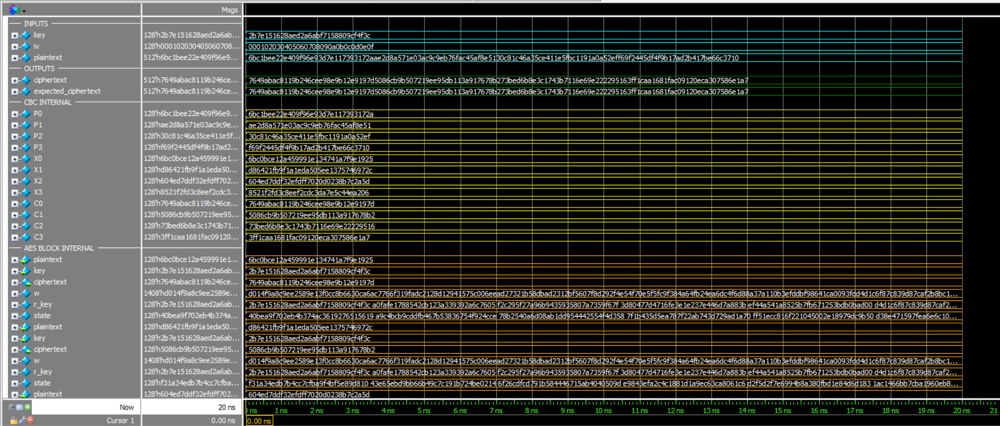
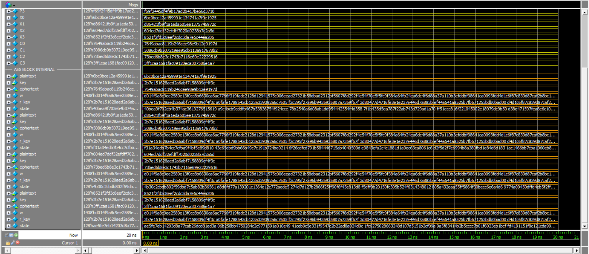
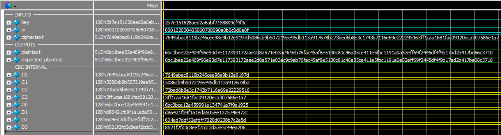

# Advanced Encryption Standard (AES) Hardware Accelerator in Verilog

A comprehensive, modular, and parameterizable hardware implementation of the **Advanced Encryption Standard (AES)** (FIPS 197) in Verilog HDL. This repository includes complete data paths for both **Encryption** and **Decryption**, support for **Cipher Block Chaining (CBC)** mode, dynamic **Key Expansion & Scheduling**, and rigorous verification testbenches verified via ModelSim.

---

## 🚀 Key Features

- **Configurable Key Lengths:** Supports AES-128, AES-192, and AES-256 (configured via `aes_params.vh`).
- **Complete Encrypt & Decrypt Cores:**
  - *Encryption:* Initial AddRoundKey, 9/11/13 standard rounds (`encrypt_round`), and a specialized final round (`encrypt_final_round`).
  - *Decryption:* Initial Inverse Round (`decrypt_initial_round`), 9/11/13 inverse rounds (`decrypt_round`), and final AddRoundKey.
- **CBC Mode Support:** Includes `AES_CBC_Encrypt` and `AES_CBC_Decrypt` top modules handling 4-block (512-bit) message streams with Initialization Vector (IV) chaining [a FSM to be implemented].
- **On-the-Fly Key Expansion & Scheduling:** Dedicated `key_expansion` and hardware `key_scheduler` supporting round key generation for both forward and inverse ciphers.
- **Verification & Simulation Suite:** Comprehensive unit and integration testbenches with ModelSim automation scripts (`run.do`), captured simulation wave outputs, and test transcripts.

---

## 📂 Repository Structure

```text
D:\NTI 2026\AES_NTI\
│
├── aes_params.vh             # Global parameters (Key sizes, state width, number of rounds)
├── add_vector.v              # Utility vector addition module
├── structure.jpeg            # Hardware architecture block diagram
├── modelsim.ini              # ModelSim configuration
│
├── Encrypt/                  # AES Encryption Datapath Modules
│   ├── Encrypt_Top.v         # Top-level AES encryption core
│   ├── AES_CBC_Encrypt.v     # CBC mode encryption wrapper (4 blocks)
│   ├── encrypt_round.v       # Standard encryption round (SubBytes, ShiftRows, MixColumns, AddRoundKey)
│   ├── encrypt_final_round.v # Final encryption round (SubBytes, ShiftRows, AddRoundKey)
│   ├── subbytes.v            # S-Box Substitution layer
│   ├── sbox.v                # AES S-Box combinational logic
│   ├── ShiftRows.v           # ShiftRows transformation
│   ├── col_mix.v             # MixColumns transformation
│   ├── col_mix_single.v      # Single column mix multiplier
│   ├── add_round_key.v       # AddRoundKey XOR operation
│   ├── key_expansion.v       # Key schedule expansion logic
│   ├── key_scheduler.v       # Round key selector (forward/inverse)
│   └── run.do                # ModelSim automation script for encryption
│
├── Decrypt/                  # AES Decryption Datapath Modules
│   ├── Decrypt_Top.v         # Top-level AES decryption core
│   ├── AES_CBC_Decrypt.v     # CBC mode decryption wrapper (4 blocks)
│   ├── decrypt_round.v       # Standard inverse round (InvShiftRows, InvSubBytes, AddRoundKey, InvMixColumns)
│   ├── decrypt_initial_round.v# Initial inverse round
│   ├── inv_subbytes.v        # Inverse S-Box Substitution layer
│   ├── inv_sbox.v            # Inverse S-Box logic
│   ├── InvShiftRows.v        # Inverse ShiftRows transformation
│   ├── inv_col_mix.v         # Inverse MixColumns transformation
│   ├── inv_col_mix_single.v  # Single column inverse mix multiplier
│   └── run.do                # ModelSim automation script for decryption
│
├── Testbenches/              # Self-checking Testbenches
│   ├── AES_CBC_Encrypt_tb.v  # CBC encryption testbench
│   ├── AES_CBC_Decrypt_tb.v  # CBC decryption testbench
│   ├── encrypt_decrypt_round_tb.v
│   ├── subbytes_tb.v / inv_subbytes_tb.v
│   ├── ShiftRows_tb.v / InvShiftRows_tb.v
│   ├── col_mix_tb.v / inv_col_mix_tb.v
│   ├── key_expansion_tb.v / key_scheduler_tb.v
│   └── ...
│
├── Results/                  # Verification Artifacts
│   ├── WAVE/                 # Simulation waveform snapshots (.png)
│   └── Transcript/           # Simulation text logs and transcripts (.txt)
│
└── Reference/                # Standards and Documentation
    ├── NIST.FIPS.197-upd1.pdf# Official NIST AES FIPS-197 Standard
    └── AES_ModesA_All.pdf    # NIST SP 800-38A Cipher Modes Documentation
```

---

## ⚙️ Configuration & Parameters

The core parameters are defined globally in `aes_params.vh`:

```verilog
`define AES_KEY_SIZE_128 1
// `define AES_KEY_SIZE_192 2
// `define AES_KEY_SIZE_256 3
```

- **State Width:** 128 bits (4x4 matrix of bytes).
- **Rounds:** 10 for 128-bit keys, 12 for 192-bit keys, 14 for 256-bit keys.

---

## 🔬 Simulation & Verification

To run simulations and verify the design using **ModelSim / QuestaSim**:

1. Open ModelSim and change directory to either `Encrypt/` or `Decrypt/`.
2. Execute the provided do-script:
   ```tcl
   do run.do
   ```
3. Inspect waveform outputs in `Results/WAVE/` and transcripts in `Results/Transcript/`.

---

## 📊 Results & Simulation Waveforms

Below are the simulation waveform results captured from ModelSim for AES-128 CBC Encryption and Decryption modes:

### 1. AES CBC Encryption Waveform


### 2. AES CBC Encryption Waveform


### 3. AES CBC Decryption Waveform


---

## 📚 References

- [NIST FIPS 197: Advanced Encryption Standard (AES)](https://csrc.nist.gov/publications/detail/fips/197/final)
- [NIST SP 800-38A: Recommendation for Block Cipher Modes of Operation](https://csrc.nist.gov/publications/detail/sp/800-38a/final)

---

## 👤 Authors

Submitted to **Eng. Ahmed Husseiny**.

**Project Team:**
- Ebram Adeb Alfi
- Radwa Mohammed Reda Ahmed
- Menna Mahmoud Mohammed Abd-Elhameed
- Youssef Haggag Fawzy Morsy
